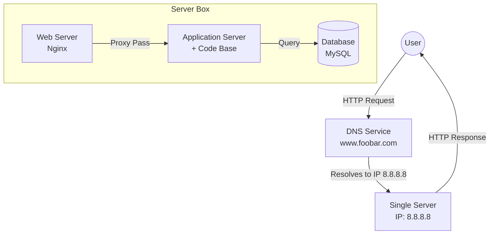

# 0. Simple web stack

## Infrastructure Specifics
- **Server**: A physical or virtual machine that provides services, resources, or data to other computers (clients) over a network.
- **Domain Name**: A human-readable address (like `foobar.com`) used to access websites. It translates to an IP address via DNS so users don't have to remember numbers.
- **DNS Record `www`**: This is a **CNAME** (Canonical Name) record pointing to the domain name (e.g., `www.foobar.com` points to `foobar.com`) or an **A** record pointing directly to the server's IP address (`8.8.8.8`).
- **Web Server (Nginx)**: Software that handles HTTP/HTTPS requests from clients. It serves static content (HTML, CSS, Images) and passes dynamic requests to the application server.
- **Application Server**: Software that executes the application logic (code base), processes data, and interacts with the database to generate dynamic content.
- **Database (MySQL)**: A structured collection of data. It stores, retrieves, and manages the application's persistent data.
- **Communication**: The server communicates with the user's computer using **HTTP/HTTPS** protocols over **TCP/IP**.

## Issues with this Infrastructure
- **SPOF (Single Point of Failure)**: There is only one server. If it crashes, loses power, or has network issues, the entire website goes down.
- **Downtime during Maintenance**: To deploy new code or update software (like the web server), services often need to be restarted, causing temporary unavailability for users.
- **Scalability**: It cannot handle high traffic. The single server has limited resources (CPU, RAM). Vertical scaling (adding more power) has a limit, and horizontal scaling is not possible in this setup.

## Diagram
