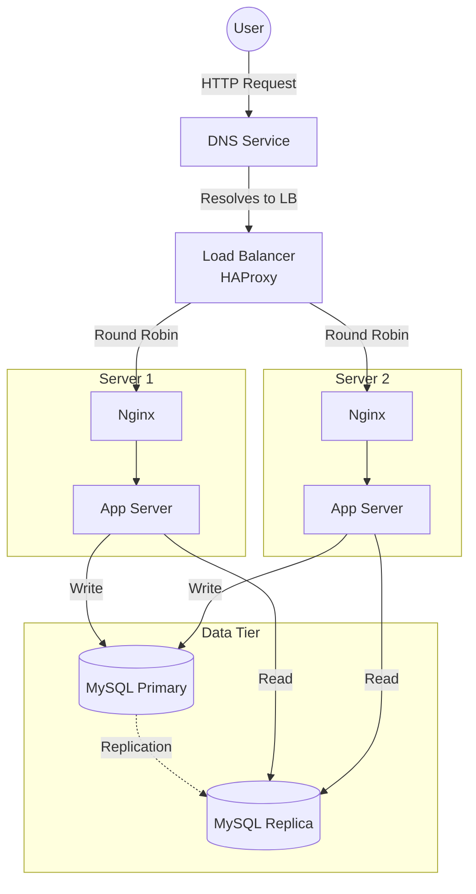

# 1. Distributed Web Infrastructure

## Infrastructure Specifics
- **Load Balancer (HAProxy)**: 
  - **Why added**: To distribute incoming traffic across the two servers, preventing any single server from becoming a bottleneck and ensuring reliability.
  - **Algorithm**: **Round Robin**. It works by forwarding client requests to each server in turn (e.g., Request 1 -> Server 1, Request 2 -> Server 2, Request 3 -> Server 1).
  - **Active-Active vs Active-Passive**:
    - **Active-Active**: Two or more load balancers are active and share the traffic. If one fails, the others handle the load.
    - **Active-Passive**: One load balancer handles all traffic (Active), while the other sits idle (Passive) monitoring the active one. If the Active fails, the Passive takes over.
    - *In this specific design (with 1 LB)*: We cannot have true HA for the LB itself without a second one, so it is a SPOF. A single LB setup is effectively "Active" but without a "Passive" backup or "Active" peer.
- **2 Servers**:
  - **Why added**: To provide redundancy. If one server fails, the LB can direct traffic to the remaining healthy server. Also allows for handling more concurrent users (Horizontal Scaling).
- **Database (Primary-Replica / Master-Slave)**:
  - **How it works**: The **Primary** node receives all write operations. These changes are logged (binlog) and replicated to the **Replica** node(s). The Replica node applies these changes to stay synchronized.
  - **Difference**:
    - **Primary**: Used for **Writes** (INSERT, UPDATE, DELETE) and generally Reads. The application sends data modification requests here.
    - **Replica**: Used for **Reads** (SELECT). The application can read data from here to reduce load on the Primary.

## Issues with this Infrastructure
- **SPOF (Single Point of Failure)**: The **Load Balancer** is a single point of failure. If it goes down, the application becomes unreachable.
- **Security Issues**:
  - **No Firewall**: Nothing filters incoming traffic. Ports might be exposed to attackers.
  - **No HTTPS**: Traffic is unencrypted. Sensitive data (passwords, cookies) can be intercepted using Man-In-The-Middle attacks.
- **Monitoring**: There is no monitoring. We don't know the health of servers, CPU usage, or if the site is down until a user reports it.

## Diagram
