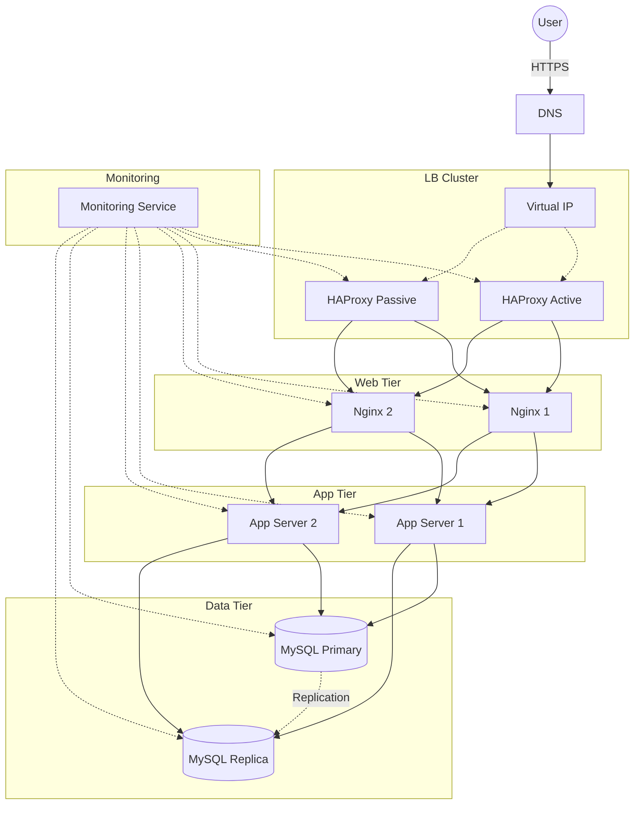

# 3. Scale up

## Infrastructure Specifics
- **Load Balancer Cluster (HAProxy)**: 
  - Added a second Load Balancer to create a High Availability (HA) cluster.
  - This eliminates the Load Balancer as a Single Point of Failure (SPOF).
  - Configured in Active-Passive mode (or Active-Active). If the active LB fails, the passive one takes over immediately using tools like Keepalived.

- **Split Web Server and Application Server**:
  - **Web Server (Nginx/Apache)**: Responsible for handling HTTP/HTTPS requests and serving static content (HTML, CSS, JS, Images). It forwards dynamic requests to the Application Server.
  - **Application Server (Python/Node/Ruby)**: Responsible for executing the business logic and generating dynamic content.
  - **Why split them?**:
    - **Independent Scaling**: You can scale the web tier (handling connections) independently from the app tier (processing logic).
    - **Performance**: Web servers are optimized for I/O and concurrency. App servers are optimized for CPU and memory processing.
    - **Security**: The web server can act as a reverse proxy and firewall, shielding the application server from direct internet traffic.

- **Database**:
  - Separate server for the database as in previous steps (Primary/Replica setup recommended for redundancy).

## Diagram
